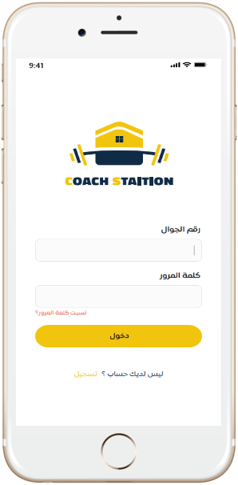

# Coach Station (Flutter Application)

It is a sports application that allows the users to find the best coaches, training and nutrition programs.

## Features

* Allow users to:
  *  view trainers, training programs, training and nutrition programs.
  * read articles.
  * add coaches and training rooms to favourites.
* Allow user to book in:
  * Virtual exercises.
  * Home exercises.
  * Nutrition programs.
* Allow the user to see their own programs such as:
  * Virtual exercises.
  * Home exercises.
  * Nutrition programs.
* Find coaches using filters.
* View the coach's profile with the ability to:
  * View the training places where the trainer works.
  * View trainer's certificates.
* Search for training programs using filters.
* Allow the user to view the details of the programs and their progress.
* Update user profile.
* Possibility to change the language.

#### Code Quality

* Write readable and reusable code.
* Use single responsibility for the classes and functions.
* Work with models.
* Easy to modify user interface.

## Screenshots

&nbsp;

&nbsp;

&nbsp;

&nbsp;

&nbsp;

#### Dependencies:
- flutter_localizations
- provider
- webview_flutter
- firebase_messaging
- firebase_core
- shared_preferences
- dio
- pull_to_refresh
-  flutter_launcher_icons

# What's Next?
 - [X] Add backend.
 - [ ] Testing App.